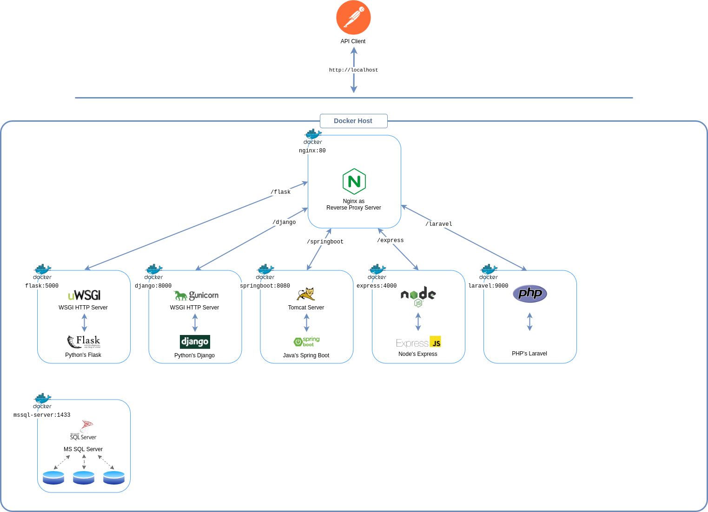

# planetary demo Project
Bench-marking popular Web Frameworks for Microservices. planetary demonstration project is comprised of:
* a NGINX reverse proxy server
* Microservices written in Django, Flask, Spring Boot, Express and Laravel
* MS SQL Server databases for each Microservice


## Setup

### Pre-requisites
Install [Docker CE](https://docs.docker.com/install/) on your favourite platform. [Docker Compose](https://docs.docker.com/compose/) will be installed automatically. Make sure you have the latest version of [Compose](https://docs.docker.com/compose/install/).
### Building and Running
Run in this directory:
```
docker-compose up --build -d
```
It will build the image for each service mentioned in `docker-compose.yml` file and run their containers in detached mode.
### Create databases
Once Docker build images completes and services are up & running, you need to create database for each application.
1. List all the running containers
```
docker ps
```
2. Attach to the container running MS SQL Server
```
docker exec -ti <container_id|container_name> bash
```
3. Connect to the SQL Server instance using `sqlcmd` utility
```
/opt/mssql-tools/bin/sqlcmd -S localhost -U sa -P Alizar457
```
4. From the **sqlcmd** command prompt, paste the following Transact-SQL command to create all five databases
```SQL
CREATE DATABASE fl_planetary;
CREATE DATABASE dj_planetary;
CREATE DATABASE sb_planetary;
CREATE DATABASE ex_planetary;
CREATE DATABASE lr_planetary;
GO
```
5. `QUIT` from **sqlcmd** command prompt and then `exit` SQL Server container.
### Run database migrations
Run database migrations for each app running inside their own containers.

#### 1. Run database migrations for Flask app
```
docker exec <container_id|container_name> flask db_create
```

#### 2. Run database migrations for Django app
+ Attach to the container running Django app
```
docker exec -ti <container_id|container_name> bash
```
+ Run database migrations
```
python manage.py makemigrations
python manage.py migrate
```
+ Collect static files
```
python manage.py collectstatic --noinput
```
+ `exit` Django app container

#### 3. Run database migrations for Laravel app
```
docker exec <container_id|container_name> php artisan migrate
```

#### 4. Run database migrations for Express app
```
docker exec <container_id|container_name> npx sequelize-cli db:migrate
```

> Migrations for Spring Boot app will be initialized automatically by Hibernate/JPA.

## Browse/Consume REST APIs
1. The URL for Flask app is: `http://localhost/flask`. Documentation for REST calls: [planetary API in Flask](flask/README.md)
2. The URL for Django app is: `http://localhost/django`. Documentation for REST calls: [planetary API in Django](django/README.md)
3. The URL for Spring Boot app is: `http://localhost/springboot`. Documentation for REST calls: [planetary API in Spring Boot](springboot/README.md)
4. The URL for Express app is: `http://localhost/express`. Documentation for REST calls: [planetary API in Express](express/README.md)
5. The URL for Laravel app is: `http://localhost/laravel`. Documentation for REST calls: [planetary API in Laravel](laravel/README.md)
