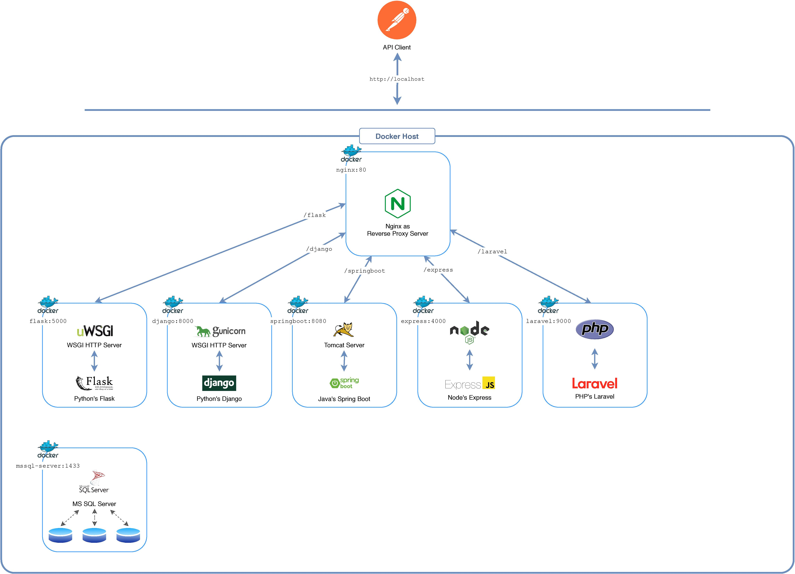

# planetary demo Project
Bench-marking popular Web Frameworks for Microservices. planetary demonstration project is comprised of:
* a NGINX reverse proxy server
* an Angular SPA running behind NGINX
* Microservices written in Django, Flask, Spring Boot, Express and Laravel
* MS SQL Server databases for each Microservice


## Setup

### Pre-requisites
Install [Docker CE](https://docs.docker.com/install/) on your favourite platform. [Docker Compose](https://docs.docker.com/compose/) will be installed automatically. Make sure you have the latest version of [Compose](https://docs.docker.com/compose/install/).

### Building and Running
1. Run in this directory:
```
docker-compose up --build -d
```
>It will build the docker image for each service mentioned in `docker-compose.yml` file and run their instances in detached mode. To scale a service, pass command line argument `--scale SERVICE=n` where SERVICE is the name of the service and n is the number of instances. 

2. Execute `./init_setup.sh` bash script to run database migrations for each of the applications.

## Browse/Consume REST APIs
1. The URL for Flask app is: `http://localhost/flask`. Documentation for REST calls: [planetary API in Flask](flask/README.md)
2. The URL for Django app is: `http://localhost/django`. Documentation for REST calls: [planetary API in Django](django/README.md)
3. The URL for Spring Boot app is: `http://localhost/springboot`. Documentation for REST calls: [planetary API in Spring Boot](springboot/README.md)
4. The URL for Express app is: `http://localhost/express`. Documentation for REST calls: [planetary API in Express](express/README.md)
5. The URL for Laravel app is: `http://localhost/laravel`. Documentation for REST calls: [planetary API in Laravel](laravel/README.md)

## Contributing
Contribute to this codebase. Help to update, optimize and fix bugs.
+ Create same Microservies in other Web Frameworks like ASP.NET, ASP.NET Core and Rails etc.